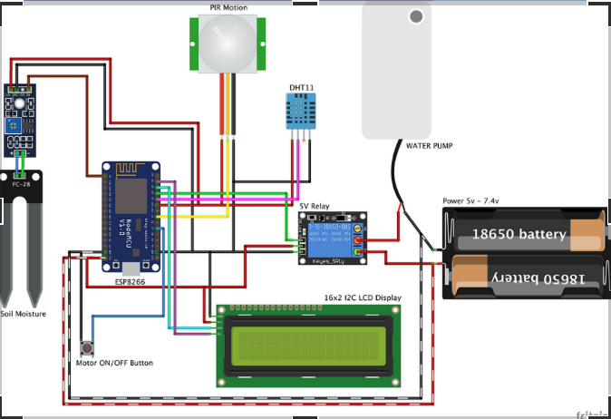
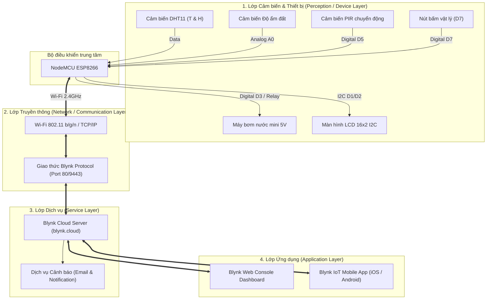

# Smart Plant IoT - Hệ Thống Nông Nghiệp Thông Minh

> **Đề tài Bài tập lớn môn Phát triển hệ thống IoT**  

---

## Giới thiệu dự án

**Smart Plant IoT** là mô hình nông nghiệp thông minh thu nhỏ ứng dụng công nghệ Internet of Things (IoT), cho phép tự động hóa quy trình theo dõi và chăm sóc cây trồng. Hệ thống sử dụng vi điều khiển **ESP8266 (NodeMCU)** làm bộ điều khiển trung tâm, tích hợp các cảm biến thu thập thông số môi trường theo thời gian thực (nhiệt độ, độ ẩm không khí, độ ẩm đất, phát hiện chuyển động), đồng thời kết nối nền tảng đám mây **Blynk IoT Cloud** để giám sát và điều khiển máy bơm từ xa thông qua ứng dụng di động và giao diện web.

---

## Tính năng chính

- **Giám sát môi trường thời gian thực:**
  - Đo nhiệt độ (°C) và độ ẩm không khí (%) bằng cảm biến DHT11.
  - Đo độ ẩm của đất (%) bằng cảm biến độ ẩm dạng que cắm chuyên dụng.
- **Hiển thị trực quan tại chỗ:**
  - Màn hình LCD 16x2 chuẩn giao tiếp I2C hiển thị liên tục trạng thái: Nhiệt độ (`T`), Độ ẩm không khí (`H`), Độ ẩm đất (`S`), Chế độ cảm biến chuyển động (`M`), Trạng thái máy bơm nước (`W`).
- **Giám sát & Điều khiển từ xa (Blynk IoT):**
  - Đồng bộ dữ liệu lên Dashboard Blynk Cloud (hỗ trợ cả Web Browser và App Android/iOS).
  - Bật/tắt máy bơm nước mini từ xa qua ứng dụng.
  - Bật/tắt tính năng theo dõi chuyển động từ xa.
- **Cảnh báo an ninh / chuyển động (PIR Motion Detection):**
  - Cảm biến PIR phát hiện người hoặc động vật xâm nhập khu vực cây trồng.
  - Gửi thông báo đẩy (Push Notification) và Email cảnh báo (`WARNNG! Motion Detected!`) về máy người dùng.
- **Điều khiển khẩn cấp bằng nút bấm vật lý (Physical Fallback Button):**
  - Tích hợp nút bấm cơ học trên mạch giúp bật/tắt máy bơm trực tiếp ngay cả khi mất mạng Wi-Fi hoặc mất kết nối tới Cloud.
  - Đồng bộ trạng thái tức thì giữa nút cứng và giao diện Blynk trên điện thoại.
- **Thiết kế nguồn cách ly an toàn:**
  - Máy bơm nước được cấp nguồn độc lập từ cell pin 18650 qua module Relay 5V, bảo vệ vi điều khiển ESP8266 khỏi hiện tượng sụt áp, quá dòng và xung nhiễu điện từ.

---

##  Danh mục phần cứng

| STT | Thiết bị / Linh kiện | Mô tả / Thông số kỹ thuật | Số lượng |
|:---:|:---------------------|:--------------------------|:--------:|
| 1 | **NodeMCU ESP8266** | Vi điều khiển trung tâm 32-bit Tensilica L106, Wi-Fi 802.11 b/g/n, 4MB Flash | 01 |
| 2 | **Cảm biến DHT11** | Cảm biến đo nhiệt độ (0–50°C) và độ ẩm không khí (20–90% RH) | 01 |
| 3 | **Cảm biến độ ẩm đất** | Module cảm biến đo điện trở ẩm đất (kèm mạch so sánh LM393) | 01 |
| 4 | **Cảm biến PIR HC-SR501** | Cảm biến chuyển động hồng ngoại thụ động góc quét 120° | 01 |
| 5 | **Màn hình LCD 16x2 + I2C** | Màn hình hiển thị 16 ký tự x 2 dòng, giao tiếp I2C (địa chỉ mặc định `0x27`) | 01 |
| 6 | **Module Relay 5V (1 kênh)**| Đóng cắt điện áp cho máy bơm (chân COM, NO) | 01 |
| 7 | **Máy bơm nước mini** | Động cơ bơm chìm mini 5V/DC | 01 |
| 8 | **Pin 18650 & Đế pin** | Nguồn DC riêng cấp cho động cơ máy bơm | 01 |
| 9 | **Nút nhấn (Push Button)** | Nút nhấn nhả vật lý để bật/tắt bơm thủ công | 01 |
| 10 | **Phụ kiện khác** | Breadboard, ống dẫn nước mềm, dây nối đực-cái / đực-đực | 01 bộ |

---

## Sơ đồ đấu nối dây (Pinout & Wiring)



### 1. Bảng kết nối chân với NodeMCU ESP8266

| Linh kiện | Chân linh kiện | Chân NodeMCU ESP8266 | Ghi chú |
|:---|:---:|:---:|:---|
| **LCD 16x2 (Module I2C)** | SDA | **D2** (GPIO4) | Tín hiệu I2C Data |
| | SCL | **D1** (GPIO5) | Tín hiệu I2C Clock |
| | VCC | **VIN (5V)** | Nguồn 5V |
| | GND | **GND** | Nối Mass chung |
| **Cảm biến DHT11** | DATA / OUT | **D4** (GPIO2) | Tín hiệu 1-Wire |
| | VCC | **3V3** hoặc **VIN** | Nguồn cấp |
| | GND | **GND** | Nối Mass chung |
| **Cảm biến độ ẩm đất** | AOUT (Analog) | **A0** (ADC0) | Đọc dải điện áp tương tự 0 - 3.3V |
| | VCC | **3V3** | Nguồn cấp |
| | GND | **GND** | Nối Mass chung |
| **Cảm biến PIR (HC-SR501)**| OUT | **D5** (GPIO14) | Tín hiệu số HIGH khi có chuyển động |
| | VCC | **VIN (5V)** | Nguồn cấp |
| | GND | **GND** | Nối Mass chung |
| **Module Relay 5V** | IN | **D3** (GPIO0) | Tín hiệu kích đóng/ngắt relay |
| | VCC | **VIN (5V)** | Nguồn nuôi relay |
| | GND | **GND** | Nối Mass chung |
| **Nút bấm vật lý** | Chân 1 | **D7** (GPIO13) | Sử dụng cấu hình `INPUT_PULLUP` |
| | Chân 2 | **GND** | Khi nhấn nối chân D7 xuống Mass |

### 2. Sơ đồ mạch động lực máy bơm (Nguồn độc lập)

```text
[ Cực Dương (+) Pin 18650 ] ─────────► [ Chân COM (Relay) ]
                                             │
                                       (Tiếp điểm NO)
                                             │
                                             ▼
[ Cực Âm (-) Pin 18650 ] ◄──────────── [ Cực Dương (+) Máy Bơm Mini ]
          ▲                                  │
          └──────────────────────────────────┘ [ Cực Âm (-) Máy Bơm Mini ]
```

> [!NOTE]  
> Mạch động lực điều khiển máy bơm được tách biệt hoàn toàn khỏi đường nguồn cấp vi điều khiển để tránh hiện tượng sụt áp khởi động động cơ làm reset ESP8266.

---

## Cấu hình Datastreams trên Blynk IoT

Dự án sử dụng nền tảng **Blynk IoT 2.0**:
- **Template ID:** `TMPL6WKnC62Ca`
- **Template Name:** `Smart Plant`
- **Giao thức kết nối:** Blynk TCP Client (`blynk.cloud`, Port `80`)

### Bảng cấu hình chân ảo (Virtual Pins)

| Pin ảo (Virtual Pin) | Tên Datastream | Kiểu dữ liệu | Đơn vị | Dải giá trị | Chức năng |
|:---:|:---|:---:|:---:|:---:|:---|
| **V0** | `Temperature` | Double / Float | °C | 0 – 100 | Hiển thị nhiệt độ không khí từ DHT11 |
| **V1** | `Humidity` | Double / Float | % | 0 – 100 | Hiển thị độ ẩm không khí từ DHT11 |
| **V3** | `SoilMoisture` | Integer | % | 0 – 100 | Hiển thị độ ẩm đất (đã qua ánh xạ chuẩn hóa) |
| **V5** | `Motion LED` | Integer (WidgetLED)| - | 0 / 1 | Đèn LED ảo sáng khi phát hiện chuyển động |
| **V6** | `PIR Switch` | Integer | - | 0 / 1 | Nút bật/tắt kích hoạt giám sát chuyển động |
| **V12** | `WaterPump` | Integer | - | 0 / 1 | Nút điều khiển bật/tắt máy bơm nước |

### Cấu hình Event (Sự kiện)
- **Event Name:** `pirmotion`
- **Notification Type:** In-App Notification & Email
- **Nội dung cảnh báo:** `WARNNG! Motion Detected!`
- **Thời gian gửi lại (Limit):** Giới hạn định kỳ 2 phút/lần nhằm chống spam thông báo.

---

## Cấu trúc mã nguồn & Nguyên lý hoạt động

Tệp mã nguồn chính: [`SmartPlant.ino`](file:///c:/Users/Admin/Documents/Smart%20Plan%20IoT/SmartPlant.ino)

### 1. Chu kỳ đọc dữ liệu & Bộ hẹn giờ (BlynkTimer)
Hệ thống tránh sử dụng lệnh `delay()` gây chặn luồng, thay vào đó điều phối tác vụ qua `BlynkTimer`:
- **Chu kỳ 100ms:**
  - Hàm `soilMoistureSensor()`: Đọc giá trị Analog từ chân `A0`, đảo thang đo qua công thức:
    $$\text{Độ ẩm (\%)} = 100 - \frac{\text{ADC} \times 100}{1024}$$
    (Đảm bảo 0% là đất khô hoàn toàn và 100% là đất ẩm tối đa). Ghi dữ liệu lên chân `V3`.
  - Hàm `DHT11sensor()`: Đọc nhiệt độ và độ ẩm không khí từ cảm biến DHT11. Ghi dữ liệu lên chân `V0` và `V1`.
- **Chu kỳ 500ms:**
  - Hàm `checkPhysicalButton()`: Quét trạng thái nút bấm cứng tại chân `D7`. Xử lý chống rung phím (debounce), đảo trạng thái Relay (`D3`) và cập nhật ngược trạng thái lên `V12` trên ứng dụng Blynk.

### 2. Định dạng hiển thị LCD 16x2

```text
+----------------+
|T:28.50  H:75.00|  -> Hàng 1: Nhiệt độ (T) & Độ ẩm không khí (H)
|S:65 M:ON  W:OFF|  -> Hàng 2: Độ ẩm đất (S), Chế độ PIR (M), Trạng thái bơm (W)
+----------------+
```

---

## Hướng dẫn cài đặt & Triển khai

### 1. Chuẩn bị phần mềm & Thư viện
1. Cài đặt **Arduino IDE** (phiên bản khuyến nghị: >= 1.8.19 hoặc 2.x).
2. Thêm hỗ trợ bo mạch ESP8266:
   - Vào `File` -> `Preferences` -> dán URL sau vào mục *Additional Boards Manager URLs*:
     ```text
     http://arduino.esp8266.com/stable/package_esp8266com_index.json
     ```
   - Vào `Tools` -> `Board` -> `Boards Manager...`, tìm kiếm `esp8266` và bấm **Install**.
3. Cài đặt các thư viện cần thiết qua `Library Manager` (`Sketch` -> `Include Library` -> `Manage Libraries...`):
   - `Blynk` by Volodymyr Shymanskyy
   - `DHT sensor library` by Adafruit
   - `Adafruit Unified Sensor`
   - `LiquidCrystal_I2C` by Frank de Brabander / Marco Schwartz

### 2. Cấu hình thông số kết nối
Mở tệp [`SmartPlant.ino`](file:///c:/Users/Admin/Documents/Smart%20Plan%20IoT/SmartPlant.ino) và cập nhật các thông tin mạng cùng mã xác thực Blynk:

```cpp
// Thông tin Blynk Cloud
#define BLYNK_TEMPLATE_ID "TMPL6WKnC62Ca"
#define BLYNK_TEMPLATE_NAME "Smart Plant"
#define BLYNK_AUTH_TOKEN "YOUR_BLYNK_AUTH_TOKEN"

// Thông tin kết nối Wi-Fi
char ssid[] = "YOUR_WIFI_SSID";         // Tên Wi-Fi nhà bạn (băng tần 2.4GHz)
char pass[] = "YOUR_WIFI_PASSWORD";     // Mật khẩu Wi-Fi
```

### 3. Nạp mã nguồn (Upload Code)
1. Kết nối bo mạch NodeMCU ESP8266 với máy tính qua cáp Micro-USB.
2. Trong Arduino IDE:
   - **Board:** Chọn `NodeMCU 1.0 (ESP-12E Module)`
   - **Upload Speed:** `115200`
   - **CPU Frequency:** `80 MHz`
   - **Port:** Chọn đúng cổng COM của bo mạch (ví dụ `COM3`, `COM4`...)
3. Bấm nút **Upload** và chờ quá trình nạp hoàn tất (`Done uploading`).
4. Mở **Serial Monitor** với tốc độ baud `9600` để theo dõi quá trình kết nối Wi-Fi và đồng bộ Blynk Cloud.

---

## Kiến trúc hệ thống IoT (IoT Architecture)



---

## Tài liệu tham khảo & Báo cáo
- Báo cáo chi tiết đề tài: [`Báo cáo IoT- Nhóm 8.docx.pdf`](B%C3%A1o%20c%C3%A1o%20IoT-%20Nh%C3%B3m%208.docx.pdf)
- Nền tảng Blynk IoT Documentation: [https://docs.blynk.io/](https://docs.blynk.io/)
